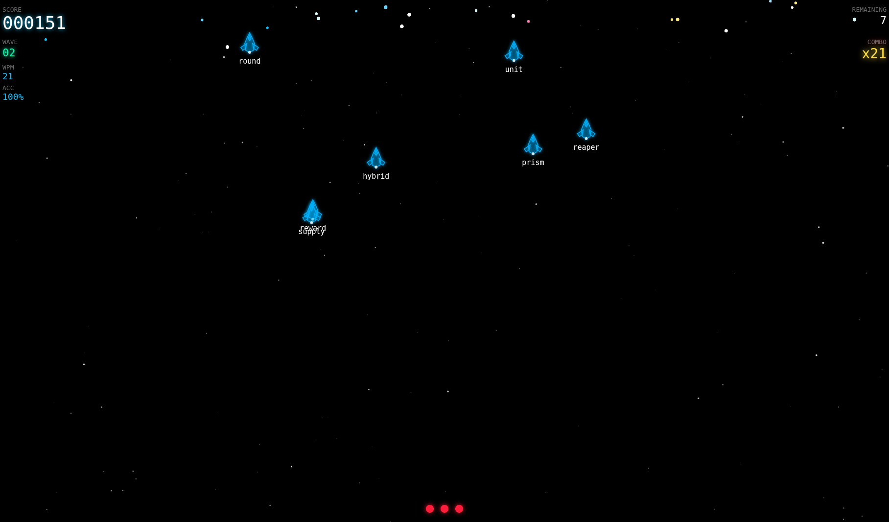

# Z-Type

A browser-based typing shooter game inspired by the classic [Z-Type](https://zty.pe). Built from scratch with TypeScript and the HTML5 Canvas API — no game engine, no dependencies, just vanilla web technology.

🎮 **[Play it live →](https://z-type-five.vercel.app/)**

---



## Gameplay

Enemies descend from the top of the screen as spaceships carrying words. Type the word to lock onto the ship and destroy it before it reaches the bottom. Miss too many and you lose a life. Clear all enemies in a wave to advance.

- **Type the first letter** of any enemy word to lock onto it
- **Complete the word** to fire a laser and destroy the ship
- **Chain kills** without mistakes to build your combo multiplier
- **Survive all waves** — each one brings faster, bigger swarms with harder words

## Features

- **Wave-based swarm spawning** — enemies arrive in bursts that grow larger and more frequent as waves progress
- **Four difficulty tiers** — easy, medium, hard, and expert word pools with hundreds of unique words
- **Adaptive difficulty engine** — tracks your WPM, accuracy, and combo to keep the challenge in your flow zone
- **Size-scaled battleships** — word length determines ship size, from small scouts to massive boss-class vessels
- **Scaled explosions** — bigger ships produce bigger particle explosions on destruction
- **Neon glow renderer** — double-stroke laser beams, per-entity glow, and a parallax starfield
- **Live HUD** — real-time score, wave number, WPM, accuracy, combo multiplier, and lives
- **Synthwave soundtrack** — ambient audio that kicks in on first interaction
- **Fully responsive** — renders at native resolution on any screen size with HiDPI/retina support

## Tech Stack

| | |
|---|---|
| Language | TypeScript |
| Renderer | HTML5 Canvas API |
| Build tool | Vite |
| Hosting | Vercel |

No game engine. No runtime dependencies. Everything — the game loop, particle system, input state machine, swarm spawner, and adaptive difficulty engine — is written from scratch.

## Architecture

```
src/
├── main.ts                  # Orchestrator — wires all systems together
├── GameLoop.ts              # Delta-time requestAnimationFrame loop
├── GameState.ts             # Single source of truth for all mutable state
├── Renderer.ts              # All canvas drawing — ships, HUD, laser, screens
│
├── entities/
│   ├── Enemy.ts             # Enemy data shape and helper functions
│   └── Particle.ts          # Particle data shape and factory
│
├── systems/
│   ├── StarField.ts         # Three-layer parallax starfield
│   ├── EnemyManager.ts      # Swarm spawner, movement, wave lifecycle
│   ├── InputHandler.ts      # Keyboard input state machine
│   ├── ParticleSystem.ts    # Particle lifecycle and size-scaled explosions
│   ├── DifficultyEngine.ts  # ML-style adaptive difficulty via performance snapshots
│   └── AudioManager.ts      # Background audio with autoplay policy handling
│
├── config/
│   ├── words.ts             # Four-tier word pools (400+ unique words)
│   └── settings.ts          # Canvas dimensions and device pixel ratio
│
└── utils/
    ├── canvas.ts            # HiDPI canvas resize utility
    └── math.ts              # randomBetween, clamp, lerp, distance
```

### Key design decisions

**Single game state object.** All mutable data lives in one `GameState` interface. No system owns hidden state. This makes the game trivial to reset, debug, and feed into the difficulty engine.

**Entity-system separation.** Entities (`Enemy`, `Particle`) are pure data interfaces with no methods. Systems (`EnemyManager`, `ParticleSystem`, `Renderer`) own all behaviour. This keeps the codebase easy to reason about and extend.

**Swarm spawner architecture.** Two independent timers — `intraSwarmDelay` (gap between enemies within a burst) and `interSwarmDelay` (gap between bursts) — produce the classic "quiet... then HERE THEY COME" rhythm. Swarm size grows from 2 to 8 enemies per burst across waves.

**Discriminated union input events.** `InputHandler` emits typed events (`word_completed`, `letter_correct`, `letter_wrong`, `no_target`) rather than mutating state directly. The orchestrator decides what each event means for scoring and combo — keeping input logic fully decoupled from game rules.

**Adaptive difficulty engine.** Samples WPM, accuracy, and combo every 5 seconds into a rolling 30-second history. Computes a weighted performance score and nudges a `pressure` scalar up or down to keep the player in the flow zone. All difficulty parameters derive from this single scalar.

## Running Locally

```bash
git clone https://github.com/perdikeas/z-type.git
cd z-type
npm install
npm run dev
```

Open `http://localhost:5173` in your browser.

## Building for Production

```bash
npm run build
```

Output is in `dist/` — a fully static site with no server required.

## License

MIT
